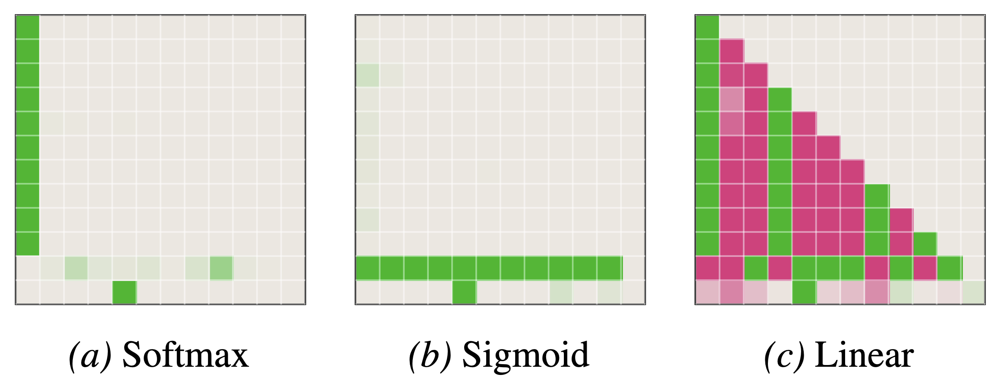

# Gradient Flow Polarizes Softmax Outputs towards Low-Entropy Solutions

[Read the paper](https://arxiv.org/abs/2603.06248)

<p align="center">
  
</p>

## Abstract

Understanding the intricate non-convex training dynamics of softmax-based models is crucial for explaining the empirical success of transformers. In this article, we analyze the gradient flow dynamics of the *value-softmax* model, defined as $\mathcal{L}(\mathbf{V} \sigma(\mathbf{a}))$, where $\mathbf{V}$ and $\mathbf{a}$ are a learnable value matrix and attention vector, respectively. As the *matrix times softmax vector* parameterization constitutes the core building block of self-attention, our analysis provides direct insight into transformer's training dynamics. We reveal that gradient flow on this structure inherently drives the optimization toward solutions characterized by low-entropy outputs. We demonstrate the universality of this polarizing effect across various objectives, including logistic and square loss. Furthermore, we discuss the practical implications of these theoretical results, offering a formal mechanism for empirical phenomena such as *attention sinks* and *massive activations*.

## Reproducing the experiments

The paper is supported by a range of experiments with small task-specific models, as well as one experiment analyzing pretrained LLMs (Figure 7 of the paper). The LLM experiment requires considerably more effort to setup and run, hence we provide the recipe for reproducing the experiments separately for small models and LLMs.

To reproduce the experiments **with small models**, do the following:

1. Install [uv](https://docs.astral.sh/uv/). 

1. Create the Python environment: in the root of the repository run `uv sync`.

1. For the experiments with value-softmax model (Section 3 of the paper), run [visualizations/toy_experiments.ipynb](visualizations/toy_experiments.ipynb).

1. Create an account in [Weights & Biases](https://wandb.ai/) if you don't have one.

1. For the experiments with induction heads (Section 4.1):
    1. Run the [wandb sweep](sweeps/induction.yaml):
        ```
        uv run wandb sweep sweeps/induction.yaml
        uv run wandb agent <SWEEP_ID>
        ```

    1. Run [visualizations/induction.ipynb](visualizations/induction.ipynb).

    1. Run [visualizations/induction_save_attn_patterns.ipynb](visualizations/induction_save_attn_patterns.ipynb).

1. For the experiments with classification (Section 4.2):
    1. Run the [wandb sweep](sweeps/classification.yaml):
        ```
        uv run wandb sweep sweeps/classification.yaml
        uv run wandb agent <SWEEP_ID>
        ```

    1. Run [visualizations/classification.ipynb](visualizations/classification.ipynb).

    1. Run [visualizations/classification_with_sample_tracking.ipynb](visualizations/classification_with_sample_trackings.ipynb).

---

To reproduce the experiment **with LLMs**, do the following:

1. Clone [axlearn-mod](https://github.com/tml-epfl/axlearn-mod) into a separate folder.

1. Install [uv](https://docs.astral.sh/uv/). 

1. Create the Python environment with the `axlearn` dependency: 
    ```
    uv sync --extra axlearn
    ```

1. Install the `gsutil` tool (e.g., as a part of the [Google Cloud CLI](https://docs.cloud.google.com/sdk/docs/install-sdk)).

1. Run the downloading and inference of softmax and sigmoid models:
    ```
    uv run python pretrained.py --model softmax --n-samples 1000
    uv run python pretrained.py --model sigmoid --n-samples 1000
    ```

1. To visualize the results, run [visualizations/pretrained.ipynb](visualizations/pretrained.ipynb).

---

## Citation information

If you find our work useful for your research, please cite it as

```
@article{varre2026gradient,
  title={Gradient Flow Polarizes Softmax Outputs towards Low-Entropy Solutions},
  author={Varre, Aditya and Rofin, Mark and Flammarion, Nicolas},
  journal={arXiv preprint arXiv:2603.06248},
  year={2026}
}
```
